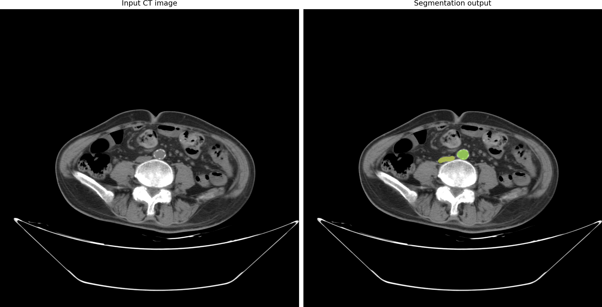

# Small AMOS22 CT example with Swin-UMamba†

This folder is a **small, reproducible starter project** for the Swin-UMamba†
model described in the supplied paper. It downloads only three AMOS22 CT
volumes (about 105 MB), prepares them in the nnU-Net layout used by the
official Swin-UMamba code, and can make a prediction when you provide a
compatible, fine-tuned checkpoint.

## Important: what “pretrained” means here

The public Swin-UMamba† starting weight is a VMamba-Tiny encoder trained on
ImageNet. It is **not** trained to recognize AMOS22 organs. A segmentation
output only becomes useful after fine-tuning on AMOS22-style labelled CT
scans. Three volumes are useful for checking that the pipeline works, but not
for training a reliable medical model.

## Requirements

Use **Linux with an NVIDIA GPU and CUDA 11.8**. The original model versions
are Python 3.10, PyTorch 2.0.1, `causal-conv1d==1.1.1`, and `mamba-ssm`.
The Mamba CUDA extensions required by this project do not have a supported
Apple Silicon / CPU-only installation path.

Create the environment and install the official repository:

```bash
conda env create -f environment.yml
conda activate swin-umamba-amos

git clone https://github.com/JiarunLiu/Swin-UMamba.git external/Swin-UMamba
pip install -e external/Swin-UMamba/swin_umamba
```

To reproduce the paper's ImageNet encoder starting point for fine-tuning,
download the official VMamba-Tiny checkpoint into the folder expected by the
repository:

```bash
mkdir -p external/Swin-UMamba/data/pretrained/vmamba
curl -L https://github.com/MzeroMiko/VMamba/releases/download/%2320240218/vssmtiny_dp01_ckpt_epoch_292.pth \
  -o external/Swin-UMamba/data/pretrained/vmamba/vmamba_tiny_e292.pth
```

If your server already has CUDA 11.8, run the commands above as written.
Check the installation with:

```bash
python -c "import torch; print(torch.__version__, torch.cuda.is_available())"
python -c "import mamba_ssm; print('Mamba installed')"
```

## Download only three AMOS22 examples

```bash
python amos_demo.py download
python amos_demo.py prepare
```

This creates `data/raw/` and
`data/nnUNet_raw/Dataset901_AMOS22_Small/`. The files are `amos_0001`,
`amos_0004`, and `amos_0005`, plus their matching labels.

## Run the full demo

After the files are downloaded, run:

```bash
python amos_demo.py
```

By default, this converts every CT file in `data/raw/train/imagesTr/` into a
normal PNG and also creates side-by-side images using the matching masks in
`data/raw/train/labelsTr/`.

The PNG inputs are saved in `outputs/converted_png/`.
The side-by-side outputs are saved in `outputs/side_by_side/`.

## Create a side-by-side visual sample

To first convert the raw CT scan into a normal image file that you can open:

```bash
python amos_demo.py export-image --input data/raw/train/imagesTr/amos_0001.nii.gz \
  --output outputs/amos_0001_input.png
```

That creates a regular PNG image from the middle CT slice.

```bash
python amos_demo.py preview --input data/raw/train/imagesTr/amos_0001.nii.gz \
  --mask data/raw/train/labelsTr/amos_0001.nii.gz --output outputs/ground_truth.png
```

The left panel is the original CT input. The right panel is the CT with the
segmentation output in colour. At this stage it is the dataset's known label;
after `predict`, use the saved model mask with this same command.

You can also make the side-by-side preview from the exported PNG:

```bash
python amos_demo.py preview --input outputs/amos_0001_input.png \
  --mask data/raw/train/labelsTr/amos_0001.nii.gz --output outputs/ground_truth_from_png.png
```

### Example output



## Make a model prediction

First fine-tune Swin-UMamba† on a proper training set. Then put the
**compatible nnU-Net trained-model folder** in `models/` (it contains files
such as `dataset.json`, `plans.json`, and `fold_0/checkpoint_final.pth`).
Run:

```bash
python amos_demo.py predict \
  --input data/raw/train/imagesTr/amos_0001.nii.gz \
  --model-folder models/YOUR_TRAINED_MODEL \
  --output outputs/prediction
```

The result is `outputs/prediction/amos_0001.nii.gz`. To make a readable PNG:

```bash
python amos_demo.py preview \
  --input data/raw/train/imagesTr/amos_0001.nii.gz \
  --mask outputs/prediction/amos_0001.nii.gz \
  --output outputs/prediction_preview.png
```

## Safety note

This is a research/demo workflow, not a clinical device. Do not use its masks
for diagnosis or patient-care decisions.
# ml-project-
